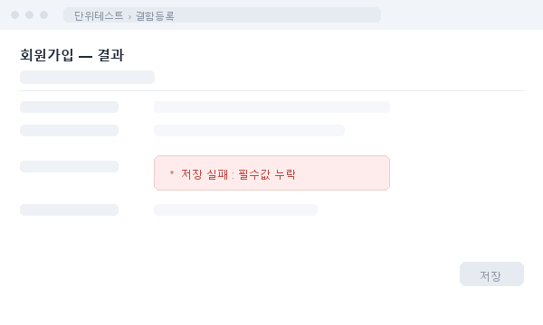
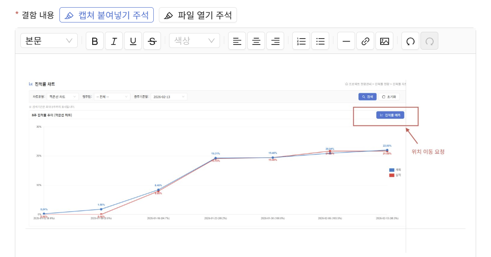
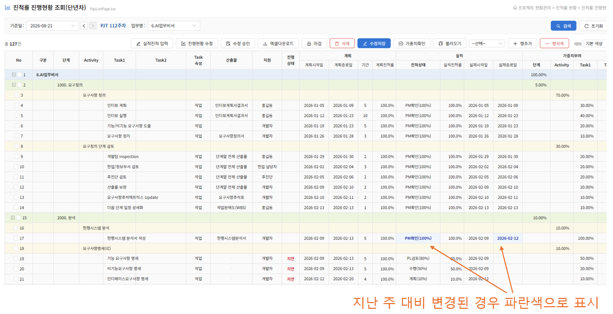

## PMS Core 오픈 — 개발 플랫폼 공유

PMS 의 개발 플랫폼인 **"PMS Core"** 를 공개합니다. AI 워크샵 등에서 만든 프로그램을 PMS 에 직접 붙여서 사용해보실 수 있습니다.

IntelliCEN PMS 의 개발 플랫폼을 그대로 활용하기 때문에, 화면 하나를 만들 때 필요한 기본기들을 새로 만들 필요가 없습니다.

- **로그인**: PMS 계정 체계를 그대로 사용합니다. 별도 회원가입·인증 로직을 만들 필요가 없습니다.
- **사용자관리**: 권한·조직 정보도 PMS 것을 그대로 씁니다.
- **게시판**: 문의·공지 같은 기본 게시판 기능을 바로 가져다 붙일 수 있습니다.
- **디자인(CSS)**: PMS 의 화면 스타일을 그대로 재활용해서, 완성도 있는 화면을 빠르게 만들 수 있습니다.

이렇게 만든 프로그램은 **AI 과제 워크샵의 우수 사례를 실제로 구현해보는 통로**가 되고, 그렇게 만들어진 결과물은 IntelliCEN PMS 와 함께 계속 발전해나갈 수 있습니다.

## 결함관리 — 이미지 등록 시 주석 첨가

예전에는 별도의 화면 캡처 도구로 화면을 딴 뒤, 설명을 위해 PPT에 그림을 그려 PMS 결함등록 화면에 붙여넣거나 글로 길게 적어야 했습니다. 이제는 **PMS 자체 캡처 도구**로 바로 캡처하고, 그 이미지 위에 결함 내용을 **PPT처럼** 직접 그려 넣을 수 있습니다.

| | 이전 | 현재 |
|---|---|---|
| 1 | 별도 화면 캡처 도구로 캡처 | PMS 자체 캡처 도구로 바로 캡처 |
| 2 | 결함 설명을 위해 PPT를 사용 | 결함등록 화면에서 PPT처럼 작성 |
| 3 | PMS 결함등록 화면에 붙여넣기 | 이미지에 결함 내용을 직접 표시 |
| 4 | 결함 설명을 텍스트로 길게 입력 | 사각형·화살표·설명으로 콕 짚기 |

**세 가지 도구면 충분합니다**

- **사각형** — 문제가 난 영역을 감싸 강조합니다
- **화살표** — 어느 지점인지 콕 집어 가리킵니다
- **텍스트 설명** — "여기서 오류" 같은 라벨을 이미지 위에 답니다

색은 기본이 빨강이고, 굵기·색 변경과 되돌리기도 됩니다. 다 그렸으면 저장 — 도형이 이미지에 하나로 합쳐진 한 장으로 결함 내용에 들어갑니다.

▶ [움직이는 화면으로 보기](https://yonghyun0923-maker.github.io/intelliCEN_newsletter/issues/2026-09-vol01/)

**다시 고칠 수도 있습니다**: 저장한 주석 이미지를 나중에 클릭하면, 그렸던 사각형·화살표가 그대로 살아난 상태로 다시 열립니다. 위치를 옮기거나 지우고 다시 저장하면 됩니다. (예전에 등록해 둔, 주석 정보가 없는 이미지는 다시 편집되지 않습니다.)

> **알아두기**
> - 이미지가 크면 저장이 조금 느릴 수 있어요. 꼭 필요한 부분만 캡처하면 빠릅니다.
> - 개인정보(실명·사번·연락처)가 담긴 화면은 사각형으로 가린 뒤 올려주세요.
> - 지금은 단위테스트·통합테스트 결함에서 쓸 수 있습니다.

## 프로젝트현황(WBS) — 2건 개선

- **수식 유지 엑셀 업로드**: WBS 를 엑셀로 업로드할 때 더 이상 수식을 제거하지 않아도 됩니다. 수식이 그대로 들어있는 파일도 바로 등록됩니다. 매번 수식을 값으로 바꿔서 올리던 번거로움이 사라집니다.
- **주간 변경사항 비교**: WBS 화면에서 지난주 대비 무엇이 바뀌었는지 바로 확인할 수 있습니다. 아래 화면처럼 계획진척률·실제진척률이 지난주와 달라진 항목은 **파란색 글자**로 표시되어, 매주 처음부터 훑어보지 않아도 변경분만 바로 눈에 띕니다.

